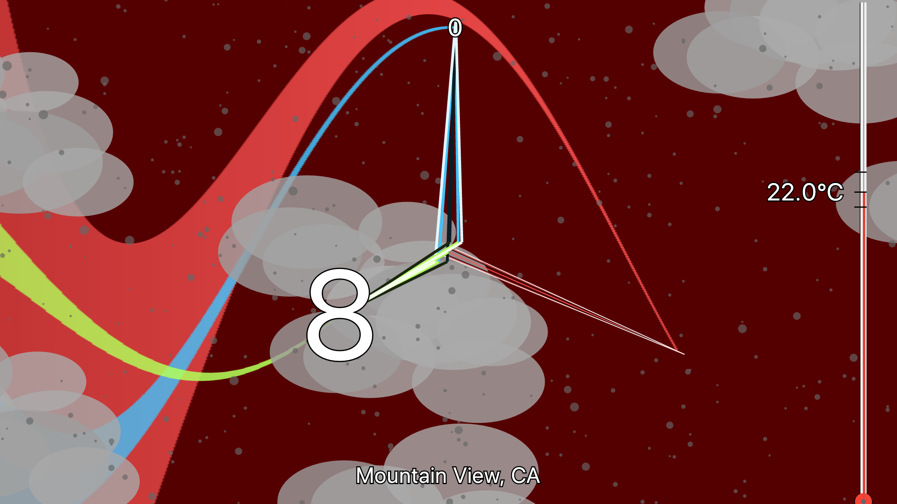

# Analog Clock

This clock shows you the time and weather in either light or dark themes.
Time is shown by the clock hands, the numbers on the hands, and the position of the sun.
The clock hands leave trails -- which flutter when it is windy.
They are otherwise obscured by the clouds, fog, rain, snow, or a thunderstorm.

[Live](https://curtcox.github.io/flutter_clock/analog_clock/build/web/#/)

